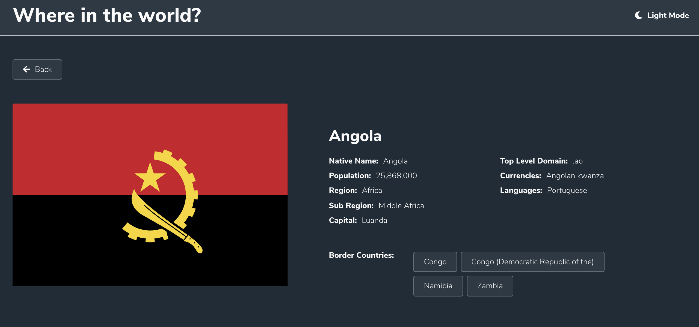
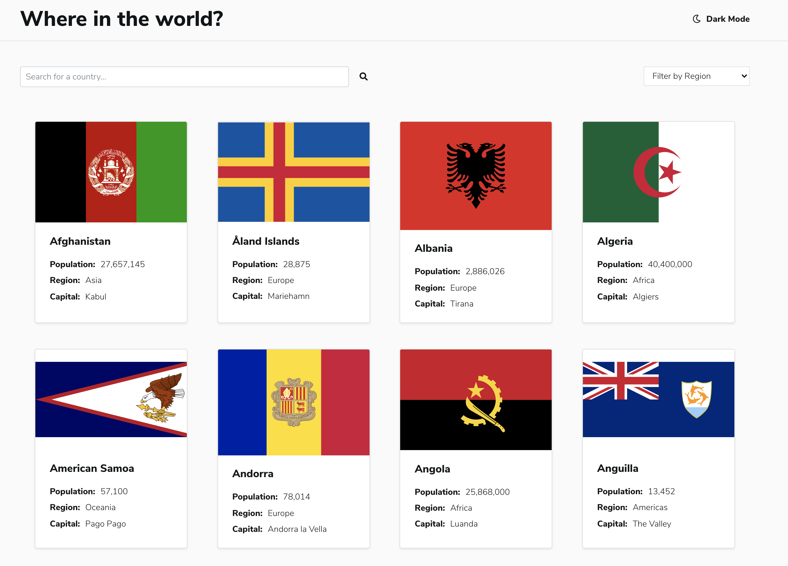
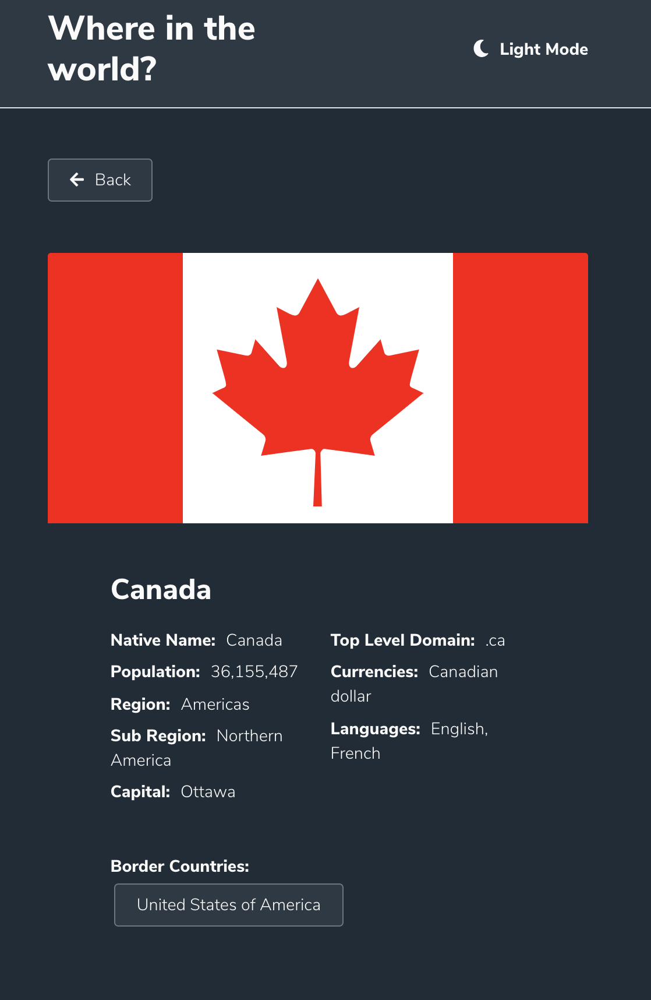

# Frontend Mentor - REST Countries API with color theme switcher solution

This is a solution to the [REST Countries API with color theme switcher challenge on Frontend Mentor](https://www.frontendmentor.io/challenges/rest-countries-api-with-color-theme-switcher-5cacc469fec04111f7b848ca).

## Table of contents

- [Overview](#overview)
  - [The challenge](#the-challenge)
  - [Screenshot](#screenshot)
  - [Links](#links)
- [My process](#my-process)
  - [Built with](#built-with)

## Overview

### The challenge

Users should be able to:

- See all countries from the API on the homepage
- Search for a country using an `input` field
- Filter countries by region
- Click on a country to see more detailed information on a separate page
- Click through to the border countries on the detail page
- Toggle the color scheme between light and dark mode
- Site should be responsive

### Screenshot

### Links

- Solution URL: [https://cocky-johnson-4998b1.netlify.app/](https://cocky-johnson-4998b1.netlify.app/)
- Live Site URL: [https://github.com/holjas/RestCountries](https://github.com/holjas/RestCountries)

## My process

### Built with

- React (JS library)
- Axios
- React Router DOM
- Styled Components
- SASS
- Bootstrap
